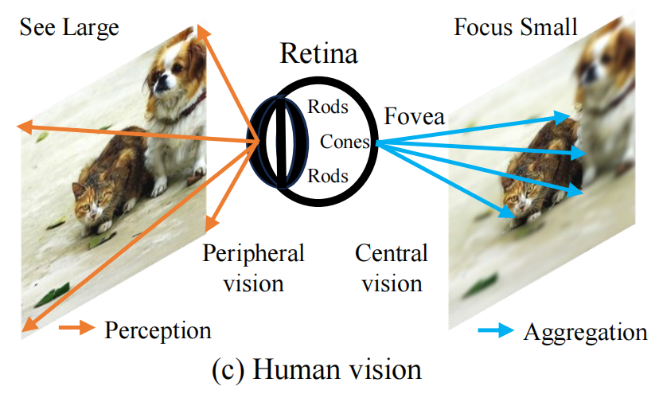
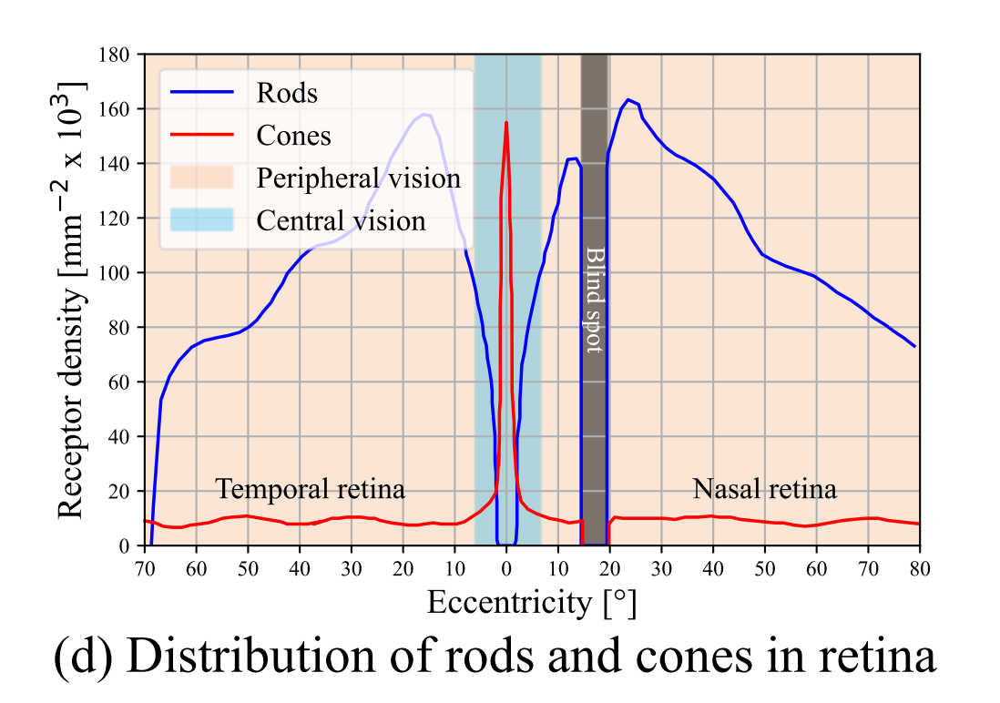
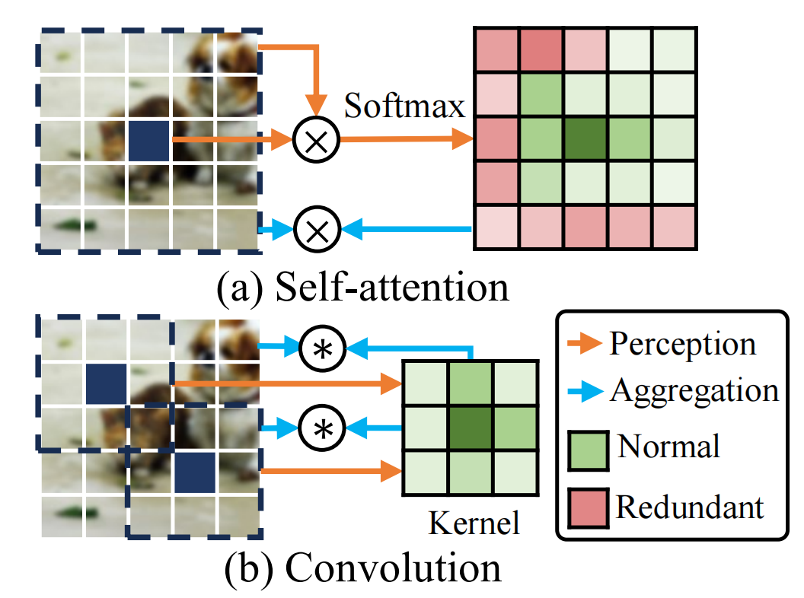
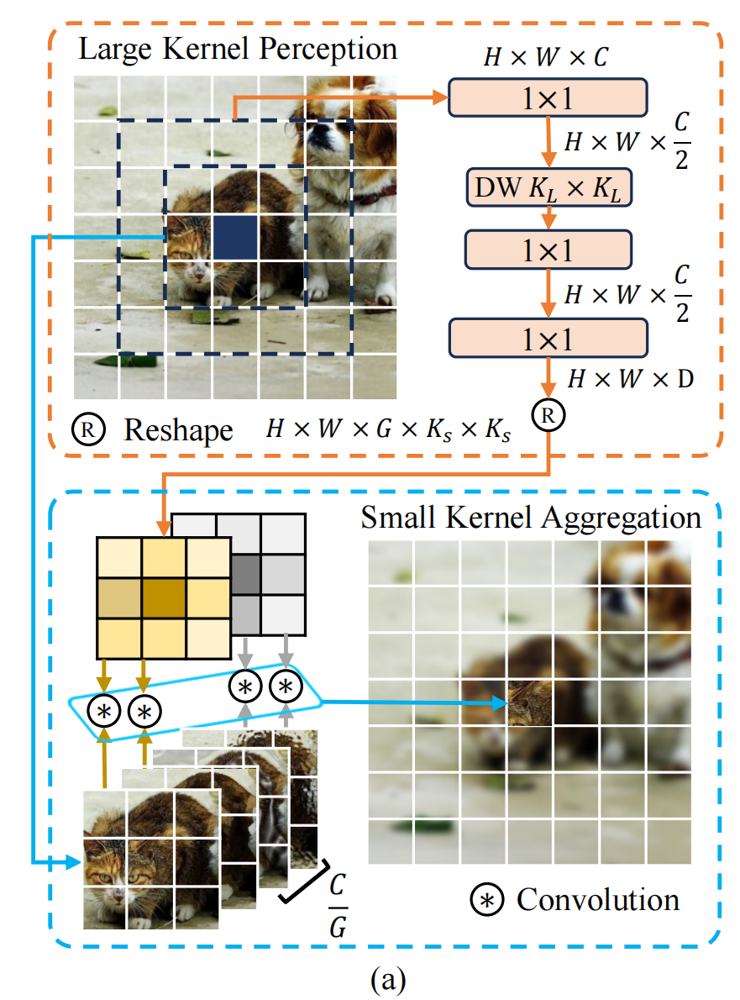
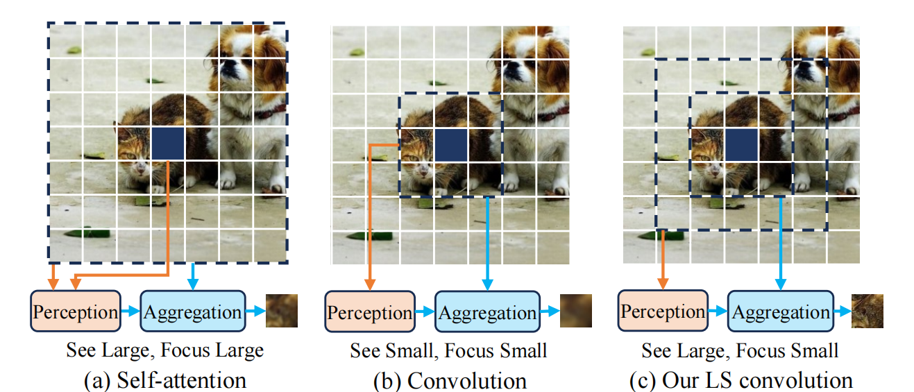
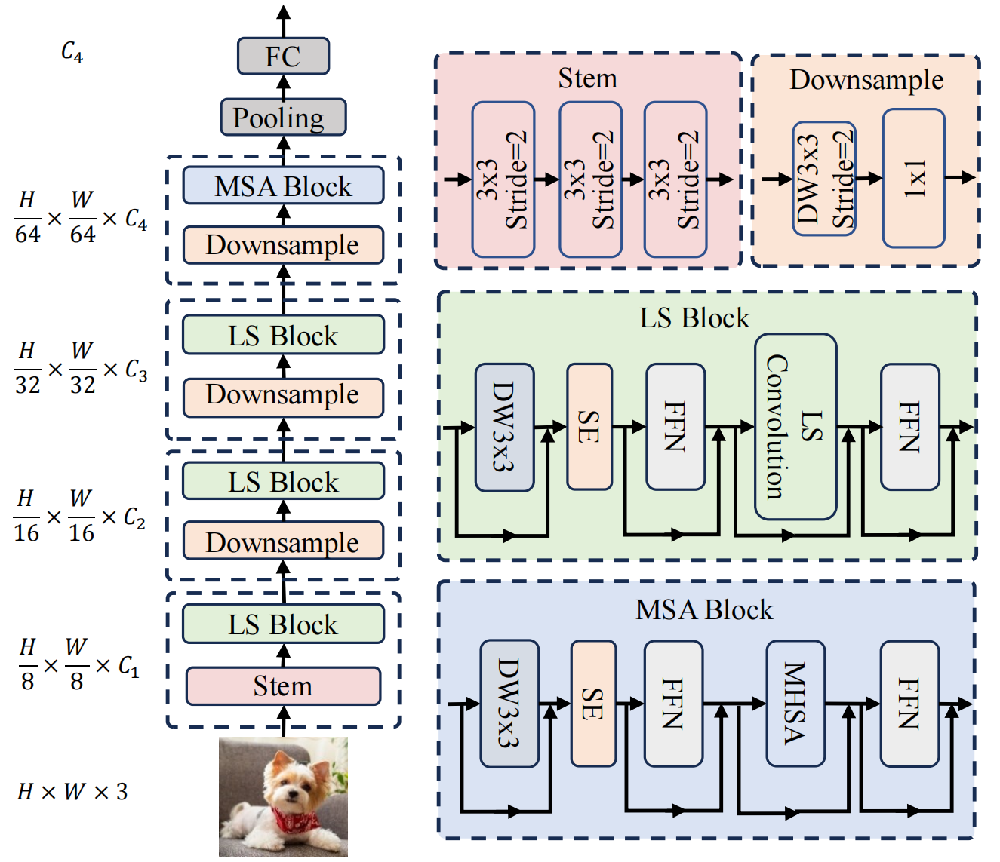

# LSNet: See Large, Focus Small

## 一、论文内容

### 1. 论文简介

#### 1.1 论文元信息
- 标题：LSNet: See Large, Focus Small
- 作者 / 机构：Ao Wang 等 / 清华
- 链接：https://arxiv.org/abs/2503.23135
- 代码：https://github.com/THU-MIG/lsnet
- 时间 / 会议：2025 CVPR

#### 1.2 一句话摘要（核心贡献）
受人类视觉系统启发，提出 “See Large, Focus Small” 策略与 LS 卷积（融合大核感知与小核聚合），构建轻量级模型 LSNet，在图像分类、检测等多任务中实现性能与效率的最优平衡。

#### 1.3 优化动机
人类视觉系统遵循 “两步机制”：
1. 首先通过周边视觉的大视野感知捕捉场景的整体概览（参考文献[66,73]），即 “见大（See Large）”；
2. 随后，注意力聚焦于场景特定元素，通过中央视觉的小视野聚合实现细节理解（参考文献[63,73]），即 “聚焦小（Focus Small）”。

<p align="center">
   <br>
  人类视觉的“见大观小”
</p>
<p align="center">
   <br>
  视杆细胞rod与视锥细胞cone在视网膜retina上随角度变化的分布情况
</p>

上下文感知与聚合是令牌混合的核心过程（参考文献[21,77,95]），作用是促进空间信息融合：
- 感知过程：建模令牌间的上下文关系；
- 聚合过程：基于上下文关系整合令牌特征。

现有方法存在局限性（如图1.(a)和(b)所示）：
- 自注意力（图a）：存在冗余计算；
- 卷积（图b）：对不同上下文适应性不足。

<p align="center">
   <br>
</p>

LS 卷积的核心设计：
- 采用 “大核静态卷积” 实现大视野感知；
- 采用 “小核动态卷积” 实现小视野聚合；
- 并非简单结合大核与小核卷积：先通过大核深度可分离卷积捕捉广泛上下文信息以建模空间关系，再以这些空间关系为参数，构建带分组机制的小核动态卷积，融合高关联视野内的特征。

#### 1.4 关键技术点（3~6 条）

##### 1.4.1 重看卷积与自注意力的感知（P）与聚合（A）
- **卷积**：  
  公式：$y_i = A(P(x_i, N(x_i)), N(xi))$  
  （$x_i$ 为输入特征，$N(x_i)$ 为 $x_i$ 的邻域，$P$ 为感知函数，$A$ 为聚合函数）

- **自注意力**：  
  公式1（聚合过程）：$y_i = A_{attn} (P_{attn} (x_i, X), X) = P_{attn} (x_i, X)(XW_v)$  
  公式2（感知过程）：$P_{attn} (x_i, X) = softmax(x_i W_q)(XW_k)^T$  
  （$X$ 为全局特征，$W_q/W_k/W_v$ 分别为查询/键/值投影权重）

##### 1.4.2 LS 卷积

<p align="center">
   <br>
</p>

LS 卷积的核心公式：$y_i = A(P(x_i, N_P(x_i)) , N_A(x_i))$  
（$N_P(x_i)$ 为感知阶段邻域，$N_A(x_i)$ 为聚合阶段邻域，二者范围不同）

核心特点：
1. 感知与聚合采用不同上下文范围：感知用大视野覆盖全局信息，聚合用小视野聚焦局部关联特征；
2. 低成本感知：通过大核深度可分离卷积降低计算开销，扩大感知上下文范围；
3. 自适应聚合：小范围局部区域采用自适应加权特征求和，提升特征融合精度。

现有方法与 LS 卷积的感知-聚合模式对比：

<p align="center">
   <br>
</p>

###### 1.4.2.1 大核感知（Large-Kernel Perception, LKP）
公式：$w_i = P_{LKP} (x_i, N_{K_L}(x_i)) = PW(DW_{K_L \times K_L}(PW(N_{K_L}(x_i))))$  
（$N_{K_L}(x_i)$ 为 $K_L×K_L$ 大小的感知邻域，$PW$ 为逐点卷积，$DW$ 为深度可分离卷积，$w_i$ 为感知得到的权重）

###### 1.4.2.2 小核聚合（Small-Kernel Aggregation, SKA）
[公式占位：SKA 具体计算逻辑，含分组机制与自适应加权]

##### 1.4.3 LSNet 网络结构
核心设计：
- 大部分阶段采用 LS 块（基于 LS 卷积构建）；
- 最后一个阶段（特征分辨率较低）采用 MSA 块（多头自注意力块）捕捉长程依赖（遵循参考文献[61,80]设计）；
- MSA 块细节：包含多头自注意力（MHSA），并引入深度可分离卷积和 SE 层，注入局部结构信息。

<p align="center">
   <br>
</p>

#### 1.5 数据集与评价指标
- **核心数据集**：ImageNet-1K（图像分类任务）；
- **评价指标**：参数量（Params, 单位M）、计算量（FLOPs, 单位G）、吞吐量（Throughput, 单位img/s）、Top-1准确率（单位%）。

##### 1.5.1 ImageNet-1K 分类结果对比
| Model          | Params (M) | FLOPs (G) | Throughput (img/s) | Top-1 (%) |
|----------------|------------|-----------|--------------------|-----------|
| EdgeNeXt-XXS   | 1.3        | 0.3       | 5089               | 71.2      |
| FasterNet-T0   | 3.9        | 0.3       | 14467              | 71.9      |
| ShuffleNetV2   | 3.5        | 0.3       | 9593               | 72.6      |
| AFFNet-ET      | 1.4        | 0.4       | 2877               | 73.0      |
| EfficientViT-M3| 6.9        | 0.3       | 14613              | 73.4      |
| StarNet-S1     | 2.9        | 0.4       | 5034               | 73.5      |
| LSNet-T        | 11.4       | 0.3       | 14708              | 74.9      |
| LSNet-T*       | 11.4       | 0.3       | 14708              | 76.1      |
| EdgeNeXt-XS    | 2.3        | 0.5       | 3118               | 75.0      |
| PVT-Tiny       | 13.2       | 1.9       | 2125               | 75.1      |
| MobileNetV3-L  | 5.4        | 0.2       | 7921               | 75.2      |
| FastViT-T8     | 3.6        | 0.7       | 3909               | 75.6      |
| EFormerV2-S0*  | 3.5        | 0.4       | 1329               | 75.7      |
| FasterNet-T1   | 7.6        | 0.9       | 8660               | 76.2      |
| UniRepLKNet-A  | 4.4        | 0.6       | 3931               | 77.0      |
| EfficientNet-B0| 5.3        | 0.4       | 4481               | 77.1      |
| PoolFormer-S12 | 12.0       | 1.8       | 2769               | 77.2      |
| SHViT-S3       | 14.2       | 0.6       | 8993               | 77.4      |
| RepViT-M0.9    | 5.1        | 0.8       | 4817               | 77.4      |
| LSNet-S        | 16.1       | 0.5       | 9023               | 77.8      |
| LSNet-S*       | 16.1       | 0.5       | 9023               | 79.0      |
| EdgeViT-XS     | 6.7        | 1.1       | 2751               | 77.5      |
| SwiftFormer-S* | 1.0        | 0.9       | 3376               | 78.5      |
| UniRepLKNet-F  | 6.1        | 6.2       | 3209               | 78.6      |
| FastViT-T12    | 6.8        | 1.4       | 2586               | 79.1      |
| EFormer-L1*    | 12.3       | 1.3       | 3280               | 79.2      |
| EdgeNeXt-S     | 1.3        | -         | 2128               | 79.4      |
| RepViT-M1.1    | 5.6        | 1.3       | 3604               | 79.4      |
| PVT-Small      | 24.5       | 3.8       | 1160               | 79.8      |
| AFFNet         | 5.5        | 1.5       | 1355               | 79.8      |
| LSNet-B        | 23.2       | 1.3       | 3996               | 80.3      |
| LSNet-B*       | 23.2       | 1.3       | 3996               | 81.6      |


##### 1.5.2 LS 卷积的模块迁移能力
（在 ResNet 和 DeiT 模型中替换核心算子，验证通用性）
| Model   | LS conv. | FLOPs (G) | Top-1 (%) |
|---------|----------|-----------|-----------|
| ResNet50| -        | 4.1       | 78.8      |
| ResNet50| √        | 2.6       | 80.7      |
| DeiT-T  | -        | 1.3       | 72.2      |
| DeiT-T  | √        | 0.9       | 73.0      |

### 2. 实验结果

#### 2.0 训练策略

##### 2.0.1 优化器参数
| 参数名          | 取值/说明                          |
|-----------------|-----------------------------------|
| --opt           | default='adamw'（优化器类型）     |
| --opt-eps       | default=1e-8（优化器epsilon值）   |
| --opt-betas     | default=None（优化器betas值，用默认） |
| --clip-grad     | default=0.02（梯度裁剪范数）      |
| --clip-mode     | default='agc'（梯度裁剪模式）     |
| --momentum      | default=0.9（SGD动量，若用SGD）   |
| --weight-decay  | default=0.025（权重衰减系数）     |

##### 2.0.2 学习率调度参数
| 参数名          | 取值/说明                          |
|-----------------|-----------------------------------|
| --sched         | default='cosine'（学习率调度器类型）|
| --lr            | default=1e-3（初始学习率）        |
| --lr-noise      | default=None（学习率噪声开关）    |
| --lr-noise-pct  | default=0.67（学习率噪声限制百分比）|
| --lr-noise-std  | default=1.0（学习率噪声标准差）   |
| --warmup-lr     | default=1e-6（预热阶段学习率）    |
| --min-lr        | default=1e-5（最小学习率下限）    |
| --decay-epochs  | default=30（学习率衰减周期）      |
| --warmup-epochs | default=2（学习率预热周期）       |
| --cooldown-epochs | default=10（最小学习率冷却周期） |
| --patience-epochs | default=10（Plateau调度器耐心值） |
| --decay-rate/--dr | default=0.1（学习率衰减率）     |

#### 2.1 与现有模型对比（IDC-脏污&遮挡数据集）
- **数据集**：250410_IDC-脏污&遮挡数据采集需求（特定场景分类任务）；
- **对比模型**：repvit_m06（基线模型）、LSNet_t（本文模型）。

| 模型        | 指标                                                                 | 计算量       | 参数量    | 输入size       |
|-------------|----------------------------------------------------------------------|--------------|-----------|----------------|
| repvit_m06  | th: 0.38 QA_dirt(True:4212, False:2400) T_R:93.803 M_R:95.027 F_R:96.250 | 402.28 MFlops  | 2.06 M    | (1, 3, 224, 224) |
| LSNet_t     | th: 0.50 QA_dirt<br> T_R:94.183 M_R:95.024 F_R:95.865        | 320.32 MFlops| 11.02 M   | -              |
（注：th为阈值，T_R/M_R/F_R分别为总体/正样本/负样本召回率）

#### 2.2 可落地性分析
- **适配场景**：基于上下文的轻量化分类场景（如小设备端的图像分类、特定目标检测前置分类等）；
- **核心优势**：FLOPS表现优异（计算量低），但参数量高，具备轻量化部署潜力；
- **主要限制**：SKA（小核聚合）算子需手写图形化实现（无现有通用接口）；
- **工程实现复杂度**：高；
- **关键工程风险**：SKA算子的底层实现稳定性（需适配不同框架/硬件）。

#### 2.3 实验验证建议
- **复现难度**：中；
- **潜在实现风险**：PyTorch高版本与dpflow框架不兼容（neupeak部分依赖包仅支持Python 3.8及以下），进而影响远程pipe与PyTorch标准化流程的兼容性；
- **推荐复现范围**：
  1. 核心模型结构（LSNet整体框架）；
  2. LS模块（大核感知+小核聚合的核心逻辑）；
  3. SE层（注意力增强模块，保障局部特征精度）；
- **预期验证目标**：无（需根据实际落地场景补充，如特定设备的推理速度、精度达标值等）。

## 二、结论

### 决策建议（落地 / 小试 / 观察 / 关闭）
示例：若模型轻量且精度有提升，可建议“小试”；若需特殊数据或算力，标记为“观察”。
关闭：可以根据这个思路去做魔改，但不能直接使用ska算子

### 后续行动项
- **负责人**：[待补充]；
- **时间节点**：[待补充，如“1个月内完成SKA算子实现，2个月内完成模型复现”]；
- **阶段目标**：[待补充，如“阶段1：完成SKA算子的PyTorch/dpflow适配实现；阶段2：复现LSNet_t在IDC数据集上的精度与计算量；阶段3：验证模型在目标硬件上的推理速度”]。

## 三、交付物与仓库结构
```
papers/
  ├── 20251009_YOLO26/          # 其他论文文件夹（示例）
  │   ├── README.md             # 论文核心信息、复现步骤、结果说明
  │   ├── code/                 # 代码实现（含模型定义、训练脚本、推理脚本）
  │   └── results/              # 实验结果（日志、图表、性能数据）
  ├── 20251009_DEIM/            # 其他论文文件夹（示例）
  └── 20251111_LSNet/           # 本文LSNet对应的文件夹（需补充）
      ├── README.md             # LSNet论文简介、核心技术、复现指南
      ├── code/                 # LSNet模型代码、SKA算子实现、训练/验证脚本
      └── results/              # ImageNet-1K/IDC数据集实验结果、性能对比表
```

## 四、注意事项
1. **实验对比一致性**：所有模型对比必须在“同一测试集”“相同输入大小”“相同评价指标计算方式”下进行，避免因测试条件差异导致结果偏差；
2. **模型选型优先性**：对大模型/多模态论文，优先选择 distilled（蒸馏）版本或 tiny 版本，降低复现成本与部署难度；
3. **未开源论文处理**：若论文未开源完整代码，可仅复现核心模块（采用 ablation-style 验证，即对比“有无核心模块”的性能差异）；
4. **数据合规性**：实验数据必须来自授权来源（如公开数据集、企业内部授权数据），严格遵守数据隐私与合规要求，禁止使用未授权数据；
5. **论文分享规范**：每篇论文分享时间控制在15~20分钟，重点突出“核心技术优势”“实验性能”“可落地性分析”，避免过度展开理论细节。